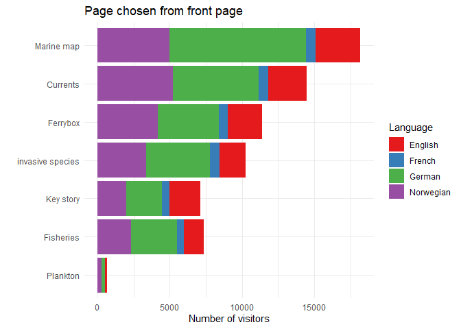
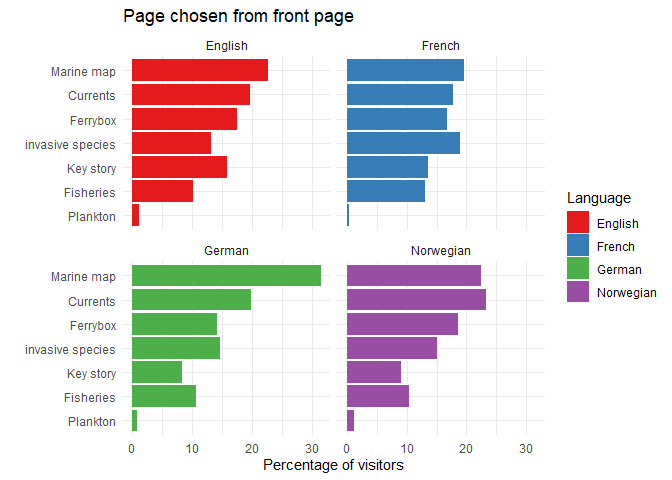
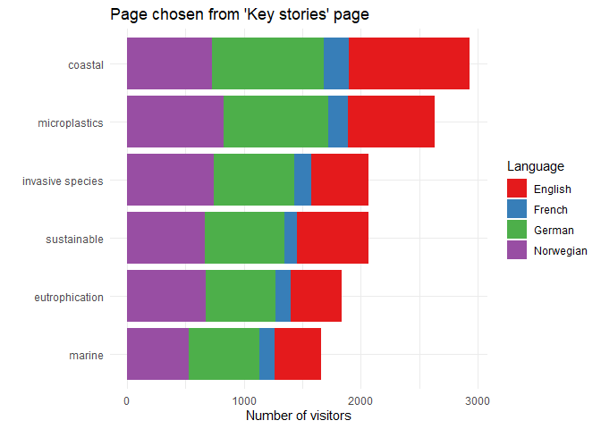
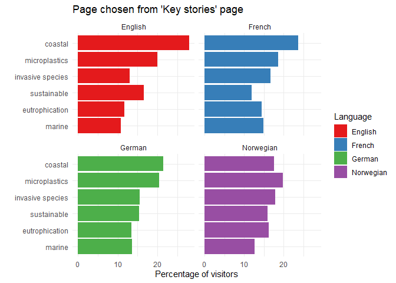

## Libraries


## Data

```r
dat <- read_excel("Input_data/Statistikk ResponSEAble - apr - des 2018.xlsx", skip = 9)
dat <- dat[,-1]
colnames(dat)[1] <- "Page"
dat <- dat %>% filter(!is.na(Visitors))

dat_frontpage <- dat %>% filter(Route %in% "From front page")
dat_keystories <- dat %>% filter(Route %in% "Via Key stories")
```


## Views from the front page

### Percentage within each language

```r
dat_frontpage <- dat_frontpage %>%
  group_by(Language) %>%
  mutate(Percent = Visitors/sum(Visitors)*100) %>%
  ungroup()
```

### Mean percentage  
And sorting of data

```r
dat_frontpage_summ <- dat_frontpage %>% 
  group_by(Page) %>% 
  summarize(Mean_percent = mean(Percent)) %>%
  arrange(desc(Mean_percent))
dat_frontpage_summ
```

```
## # A tibble: 7 x 2
##   Page             Mean_percent
##   <chr>                   <dbl>
## 1 Marine map             24.0  
## 2 Currents               20.2  
## 3 Ferrybox               16.8  
## 4 invasive species       15.5  
## 5 Key story              11.6  
## 6 Fisheries              11.1  
## 7 Plankton                0.853
```

```r
dat_frontpage$Page <- factor(dat_frontpage$Page, levels = dat_frontpage_summ %>% pull(Page) %>% rev())
```

### Plot 1

```r
ggplot(dat_frontpage, aes(Page, y = Visitors, fill = Language)) +
  geom_col() +
  coord_flip() +
  scale_fill_brewer(palette = "Set1") +
  labs(title = "Page chosen from front page", x = "", y = "Number of visitors") +
  theme_minimal()
```

<!-- -->

```r
ggsave("Figures/01_01.png", width = 6, height = 4, dpi = 400)
```

### Plot 2

```r
ggplot(dat_frontpage, aes(Page, y = Percent, fill = Language)) +
  geom_col() +
  coord_flip() +
  scale_fill_brewer(palette = "Set1") +
  facet_wrap(~Language) +
  labs(title = "Page chosen from front page", x = "", y = "Percentage of visitors") +
  theme_minimal()
```

<!-- -->

```r
ggsave("Figures/01_02.png", width = 6, height = 4, dpi = 400)
```

## Views from the key stories page

### Percentage within each language

```r
dat_keystories <- dat_keystories %>%
  group_by(Language) %>%
  mutate(Percent = Visitors/sum(Visitors)*100) %>%
  ungroup()
```

### Mean percentage  
And sorting of data

```r
dat_keystories_summ <- dat_keystories %>% 
  group_by(Page) %>% 
  summarize(Mean_percent = mean(Percent)) %>%
  arrange(desc(Mean_percent))
dat_keystories_summ
```

```
## # A tibble: 6 x 2
##   Page             Mean_percent
##   <chr>                   <dbl>
## 1 coastal                  22.7
## 2 microplastics            19.7
## 3 invasive species         15.8
## 4 sustainable              15.0
## 5 eutrophication           14.0
## 6 marine                   13.0
```

```r
dat_keystories$Page <- factor(dat_keystories$Page, levels = dat_keystories_summ %>% pull(Page) %>% rev())
```

### Plot 1

```r
ggplot(dat_keystories, aes(Page, y = Visitors, fill = Language)) +
  geom_col() +
  coord_flip() +
  scale_fill_brewer(palette = "Set1") +
  labs(title = "Page chosen from 'Key stories' page", x = "", y = "Number of visitors") +
  theme_minimal()
```

<!-- -->

```r
ggsave("Figures/01_03.png", width = 6, height = 4, dpi = 400)
```

### Plot 2

```r
ggplot(dat_keystories, aes(Page, y = Percent, fill = Language)) +
  geom_col() +
  coord_flip() +
  scale_fill_brewer(palette = "Set1") +
  facet_wrap(~Language) +
  labs(title = "Page chosen from 'Key stories' page", x = "", y = "Percentage of visitors") +
  theme_minimal()
```

<!-- -->

```r
ggsave("Figures/01_04.png", width = 6, height = 4, dpi = 400)
```
